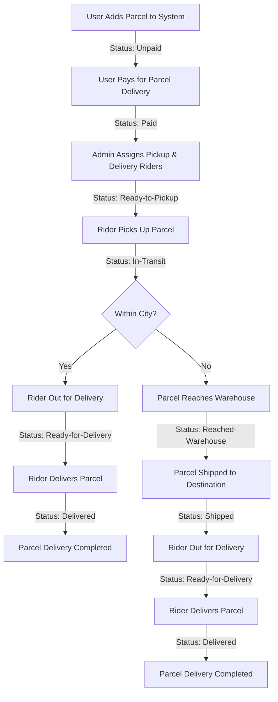

# **Zap Shift Resources**

Welcome to **Zap Shift Resources**!  
A curated collection of tools, guides, and assets for developing robust parcel management systems.

[Live link](https://zap-shift-69b8e.web.app/)

[Frontend repository](https://github.com/Pratush26/Zap-Shift-frontend)

[Backend repository](https://github.com/Pratush26/Zap-Shift-backend)

---

## 📊 System Overview Table

| Role            | Key Responsibilities                                                                      | Earnings/Benefits                              |
| --------------- | ----------------------------------------------------------------------------------------- | ---------------------------------------------- |
| **User**        | - Book parcels - Pay charges - Track status - Review service                     | - Real-time tracking - Feedback opportunity |
| **Admin**       | - Assign agents - Manage routing - Oversee warehouses - Monitor operations       | - System control - Operational oversight    |
| **Agent/Rider** | - Collect/Deliver parcels - Update status - OTP confirmation - Warehouse handoff | - ৳20 per delivery                             |

---

## 🛒 Pricing Structure

| Parcel Type      | Weight    | Within City | Outside City/District |
| ---------------- | --------- | ----------- | --------------------- |
| **Document**     | Any       | ৳60         | ৳80                   |
| **Non-Document** | Up to 3kg | ৳110        | ৳150                  |
| **Non-Document** | >3kg      | +৳40/kg     | +৳40/kg +৳40 extra    |

---

## 🚚 Delivery Workflow

---

## 🗂️ Key Features

- **Automated Pricing & Tracking**
- **Role-based Access & Workflow**
- **OTP-based Secure Delivery**
- **Nationwide Coverage (64 districts)**
- **Transparent Commission Structure**

---

---

## React + Vite

This template provides a minimal setup to get React working in Vite with HMR and some ESLint rules.

Currently, two official plugins are available:

- [@vitejs/plugin-react](https://github.com/vitejs/vite-plugin-react/blob/main/packages/plugin-react) uses [Babel](https://babeljs.io/) (or [oxc](https://oxc.rs) when used in [rolldown-vite](https://vite.dev/guide/rolldown)) for Fast Refresh
- [@vitejs/plugin-react-swc](https://github.com/vitejs/vite-plugin-react/blob/main/packages/plugin-react-swc) uses [SWC](https://swc.rs/) for Fast Refresh

## React Compiler

The React Compiler is not enabled on this template because of its impact on dev & build performances. To add it, see [this documentation](https://react.dev/learn/react-compiler/installation).

## Expanding the ESLint configuration

If you are developing a production application, we recommend using TypeScript with type-aware lint rules enabled. Check out the [TS template](https://github.com/vitejs/vite/tree/main/packages/create-vite/template-react-ts) for information on how to integrate TypeScript and [`typescript-eslint`](https://typescript-eslint.io) in your project.
